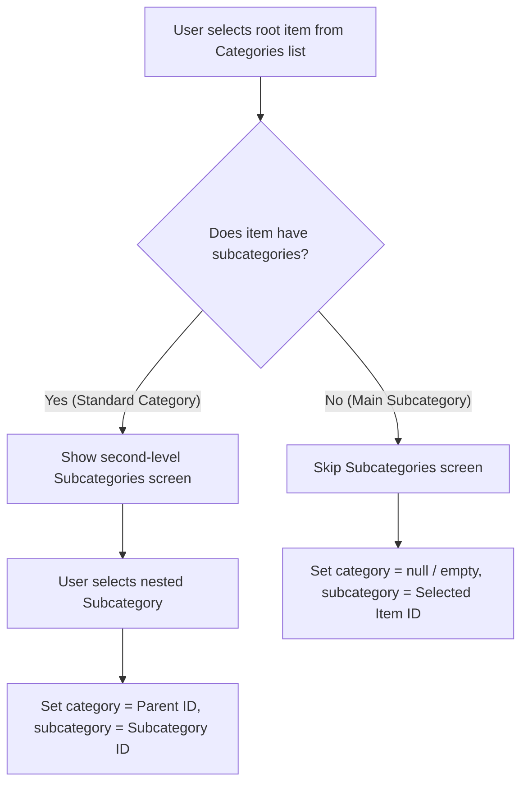

# Mobile Integration Guide: Handling Main (Parentless) Subcategories

In the system, a subcategory can exist **without a parent category** (also known as a parentless or "main" subcategory). 
This document describes how these items are returned by the API, how they should be handled in the mobile app UI, and how to create/add products under them.

---

## 1. Fetching Categories and Subcategories

The mobile app retrieves the catalog hierarchy from the home data endpoint:
* **Endpoint:** `GET /v1/api/app/home` (or the equivalent home data route)

### API Response Structure
Parentless subcategories are automatically promoted to the root level of the `categories` array. You can distinguish them because they have **no subcategories nested inside them** (the `subcategories` array is empty `[]`).

```json
{
  "success": true,
  "data": {
    "categories": [
      {
        "_id": "65f8a1a2b3c4d5e6f7a8b901",
        "name": "Electronics",
        "media": { "url": "https://..." },
        "isMainSubcategory": false,
        "subcategories": [
          {
            "_id": "65f8a1e2b3c4d5e6f7a8b902",
            "name": "Smartphones",
            "media": { "url": "https://..." },
            "customFieldDefinitions": [...]
          },
          {
            "_id": "65f8a1f2b3c4d5e6f7a8b903",
            "name": "Laptops",
            "media": { "url": "https://..." },
            "customFieldDefinitions": [...]
          }
        ]
      },
      {
        "_id": "65f8a202b3c4d5e6f7a8b904",
        "name": "Services (Main Subcategory)",
        "media": { "url": "https://..." },
        "description": "This subcategory has no parent category",
        "isMainSubcategory": true,
        "subcategories": [], 
        "customFieldDefinitions": [
          {
            "label": "Hourly Rate",
            "key": "hourly_rate",
            "fieldType": "number",
            "isRequired": true
          }
        ]
      }
    ]
  }
}
```

---

## 2. Mobile Client UI Logic

When building the UI flow for selecting categories and subcategories (e.g., in the product creation wizard):



### Swift / Kotlin Pseudo-code
```typescript
// On root Category Selection
function onCategorySelected(item) {
    if (item.isMainSubcategory) {
        // SCENARIO B: Main Subcategory (parentless)
        // It has no nested subcategories. Skip subcategory step and set the IDs directly:
        productForm.categoryId = null; // No parent category
        productForm.subcategoryId = item._id; // The item itself is the subcategory
        
        // Load custom field definitions from this root item
        loadCustomFields(item.customFieldDefinitions);
        navigateToProductDetailsScreen();
    } else {
        // SCENARIO A: Standard Category
        // Navigate user to select a nested subcategory
        navigateToSubcategoriesScreen(item.subcategories);
    }
}
```

---

## 3. Product Creation Payload

When calling the product creation endpoint (`POST /v1/api/app/products` or equivalent):

### Scenario A: Product under a standard nested subcategory
* The parent category's `_id` is sent as `category`.
* The nested subcategory's `_id` is sent as `subcategory`.

**Request Payload:**
```json
{
  "name": "iPhone 15 Pro",
  "category": "65f8a1a2b3c4d5e6f7a8b901", 
  "subcategory": "65f8a1e2b3c4d5e6f7a8b902",
  "price": 999,
  "description": "Latest Apple smartphone",
  "customFields": {}
}
```

### Scenario B: Product under a main (parentless) subcategory
* Since it has no parent category, the `category` field should be sent as `null` or omitted.
* The main subcategory's `_id` is sent as `subcategory`.

**Request Payload:**
```json
{
  "name": "AC Repair Service",
  "category": null, 
  "subcategory": "65f8a202b3c4d5e6f7a8b904",
  "price": 50,
  "description": "Professional home AC repair",
  "customFields": {
    "hourly_rate": 25
  }
}
```
